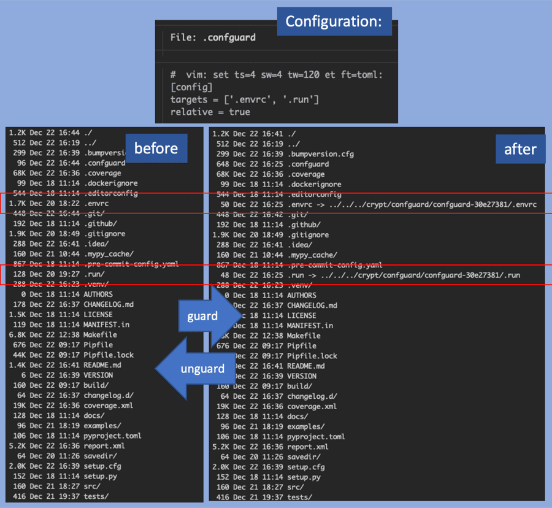

# confguard

[![PyPI Version][pypi-image]][pypi-url]

> Save sensitive configuration files outside project in save place.

Simple tool to manage sensitive configuration files outside of a project.

**Guard** project by moving sensitive files/directories to a safe place
where they can be handled properly. Symlinks replace them.

- Guard is idempotent, changes to ``.confguard`` will be picked up by re-run.
- Un-guarding restores original state.
- State is being kept in ``.confguard`` file.

## Quickstart
```bash
Usage: confguard [OPTIONS] COMMAND [ARGS]...

  Save sensitive configuration in a save place

Commands:
  find-and-link  Missing .confguard file, try to find it and link it...
  guard          Guards a directory.
  unguard        Un-guards a directory.
```

#### Install
```console
    $ pip install confguard
```



## Changelog
[CHANGELOG.md](https://github.com/sysid/confguard/blob/master/CHANGELOG.md)

<!-- Badges -->

[pypi-image]: https://badge.fury.io/py/confguard.svg
[pypi-url]: https://pypi.org/project/confguard/
[build-image]: https://github.com/sysid/confguard/actions/workflows/build.yml/badge.svg
[build-url]: https://github.com/sysid/confguard/actions/workflows/build.yml
[coverage-image]: https://codecov.io/gh/sysid/confguard/branch/master/graph/badge.svg
[coverage-url]: https://codecov.io/gh/sysid/confguard
