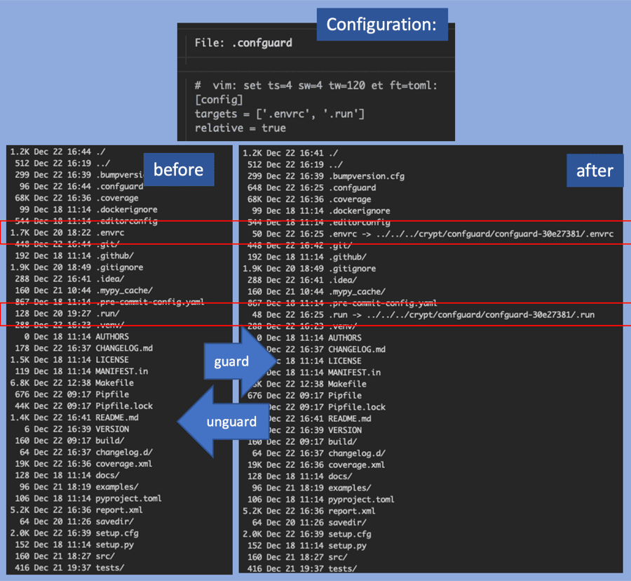

# confguard

[![PyPI Version][pypi-image]][pypi-url]

> Save configuration files outside project in save place

This is a simple tool to help managing sensitive configuration files outside of your project.

Just **"guard"** your project and sensitive files are moved to a safe place where you can
handle them seperately (e.g. encrypt).

The created links can be committed without risk.

Guarding is idempotent, changes to ``confguard`` will be applied. Un-guarding will restore
the original state. State is being kept in ``confguard`` file.

## Quickstart
```bash
Usage: confguard [OPTIONS] COMMAND [ARGS]...

  Save sensitive configuration in a save place

Commands:
  find-and-link  Missing .confguard file, try to find it and link it...
  guard          Guards a directory.
  unguard        Un-guards a directory.
```

#### Install
```console
    $ pip install confguard
```



## Changelog
[CHANGELOG.md](https://github.com/sysid/confguard/blob/master/CHANGELOG.md)

<!-- Badges -->

[pypi-image]: https://badge.fury.io/py/confguard.svg
[pypi-url]: https://pypi.org/project/confguard/
[build-image]: https://github.com/sysid/confguard/actions/workflows/build.yml/badge.svg
[build-url]: https://github.com/sysid/confguard/actions/workflows/build.yml
[coverage-image]: https://codecov.io/gh/sysid/confguard/branch/master/graph/badge.svg
[coverage-url]: https://codecov.io/gh/sysid/confguard
